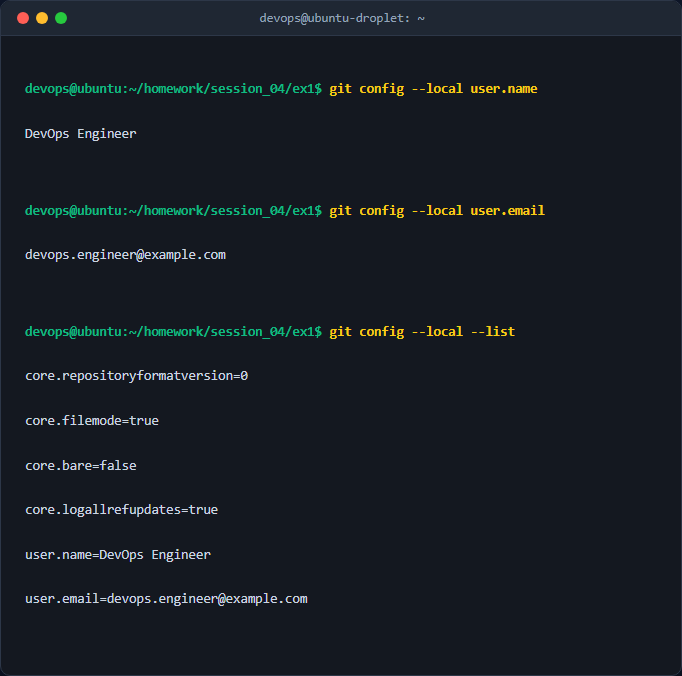
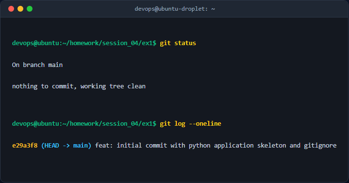

# Khởi tạo Local Repository và Cấu hình danh tính cục bộ (Local Git Configuration)

## 1. Mục tiêu & Bối cảnh kỹ thuật
Trong môi trường phát triển phần mềm chuyên nghiệp, việc quản lý mã nguồn bằng Git đòi hỏi sự phân tách rạch ròi về mặt danh tính (tác giả commit) giữa các dự án khác nhau (ví dụ: dự án cá nhân, dự án công ty, dự án của đối tác). 
Bối cảnh kỹ thuật của bài thực hành này bao gồm:
* Khởi tạo một Git Repository cục bộ hoàn toàn mới từ thư mục trắng.
* Thiết lập danh tính cục bộ (`--local`) cho tác giả của các commit, đảm bảo không ảnh hưởng đến cấu hình toàn cục (`--global`) trên hệ thống phát triển chung.
* Làm quen với quy trình đưa file từ thư mục làm việc (Working Directory) qua vùng đệm (Staging Area) và tiến hành Commit đầu tiên lên cơ sở dữ liệu Git cục bộ.
* Kiểm tra và phân tích lịch sử commit cùng các thiết lập cấu hình của Git.

---

## 2. Các bước thực hiện chi tiết

### Bước 1: Tạo thư mục dự án và di chuyển vào bên trong
Sử dụng câu lệnh Linux tiêu chuẩn để tạo cấu trúc thư mục bài tập và di chuyển thư mục hiện hành đến đó:
```bash
mkdir -p homework/session_04/ex1
cd homework/session_04/ex1
```

### Bước 2: Khởi tạo Git Repository cục bộ
Khởi tạo một kho lưu trữ Git trống để bắt đầu theo dõi các thay đổi của mã nguồn:
```bash
git init
```
*Giải thích:* Lệnh này sẽ tạo ra một thư mục ẩn có tên là `.git/` chứa toàn bộ siêu dữ liệu (metadata), đối tượng (objects) và lịch sử của kho lưu trữ.

### Bước 3: Cấu hình danh tính tác giả ở cấp độ cục bộ (Local)
Sử dụng tùy chọn `--local` để giới hạn phạm vi áp dụng cấu hình của tên và email tác giả chỉ trong dự án này:
```bash
git config --local user.name "DevOps Engineer"
git config --local user.email "devops.engineer@example.com"
```
*Phân tích kỹ thuật:* 
* Cờ `--local` chỉ định Git ghi đè các cấu hình này vào tệp tin cục bộ nằm tại `.git/config` của dự án hiện tại. 
* Điều này ngăn chặn việc thông tin cá nhân bị rò rỉ sang các dự án doanh nghiệp khác hoặc ngược lại nếu cấu hình `--global` (ở file `~/.gitconfig`) vô tình được sử dụng.

### Bước 4: Tạo các tệp tin mã nguồn và cấu hình cơ bản
Tạo tệp `.gitignore` chuyên nghiệp để ngăn việc theo dõi các tệp tin rác không cần thiết của Java, và tạo một file mã nguồn `App.java` đơn giản:
```bash
# Tạo file .gitignore
cat <<EOF > .gitignore
__pycache__/
*.py[cod]
*$py.class
.venv/
env/
venv/
.env
EOF

# Tạo file mã nguồn App.java
cat <<EOF > App.java
def main():
    print("Hello, DevOps World! Git repository initialized successfully.")

if __name__ == "__main__":
    main()
EOF
```

### Bước 5: Đưa các tệp tin vào Staging Area
Đưa các tệp tin vừa tạo từ Working Directory vào vùng chuẩn bị để chuẩn bị cho việc đóng gói commit:
```bash
git add .
```
*Giải thích:* Lệnh `git add .` sẽ quét toàn bộ thư mục hiện hành (ngoại trừ các đường dẫn được cấu hình bỏ qua trong `.gitignore`), mã hóa nội dung tệp tin thành các đối tượng Blob trong Git và cập nhật vào file index (Staging Area).

### Bước 6: Thực hiện Commit đầu tiên
Đóng gói các thay đổi đang nằm ở Staging Area và ghi nhận vào lịch sử của Git repository:
```bash
git commit -m "feat: initial commit with python application skeleton and gitignore"
```
*Giải thích:*
* `-m`: Tham số truyền thông điệp mô tả cho commit.
* Thông điệp sử dụng chuẩn *Conventional Commits* (`feat:` biểu thị cho tính năng mới) giúp việc theo dõi lịch sử phát triển và tự động hóa sinh changelog dễ dàng hơn.

---

## 3. Kiểm tra & Xác thực kết quả

### Kiểm tra cấu hình danh tính cục bộ
Thực thi các lệnh sau để kiểm tra cấu hình trong dự án hiện tại:
```bash
git config --local user.name
git config --local user.email
git config --local --list
```
Kết quả hiển thị chính xác thông tin cấu hình cục bộ, không bị ảnh hưởng bởi global:


### Xem trạng thái thư mục làm việc và lịch sử commit
Sử dụng lệnh `git status` và `git log` để xác thực lịch sử commit:
```bash
git status
git log --oneline
```
Lịch sử commit hiển thị đầy đủ ID commit, nhánh hiện tại (`main` hoặc `master`) và thông điệp commit:


---

## 4. Kết luận & Best Practices bảo mật vận hành
1. **Cô lập cấu hình dự án (`--local` vs `--global`):** Luôn sử dụng `--local` khi làm việc trên môi trường đa tài khoản hoặc máy tính dùng chung để đảm bảo tính riêng tư của email và tên tác giả, tránh rò rỉ thông tin cá nhân hoặc tổ chức.
2. **Quản lý file bỏ qua chặt chẽ (`.gitignore`):** Cần thiết lập tệp `.gitignore` đầu tiên trước khi thực hiện commit bất kỳ mã nguồn nào để ngăn chặn tuyệt đối việc đẩy nhầm các tệp nhạy cảm (file cấu hình cục bộ chứa secrets `.env`, thư mục môi trường ảo `.venv`, logs, cache, v.v.) lên hệ thống quản lý mã nguồn tập trung.
3. **Tuân thủ quy chuẩn thông điệp Commit (Commit Linting):** Sử dụng chuẩn Conventional Commits giúp việc đọc hiểu lịch sử của hệ thống trở nên rõ ràng và tạo tiền đề vững chắc cho việc tích hợp các công cụ CI/CD tự động hóa sau này.